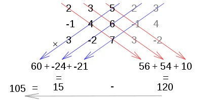

# Under EVALUATION... not to be used

# Faster_nxn_Determinant
Faster &amp; memory efficient approach to compute nxn-Determinant thru applying Sarrus' Rule (without recursion).

*[Wiki Link : https://en.wikipedia.org/wiki/Rule_of_Sarrus]*

The code-fuction made thru this algorithm is free of Function-Recursive-Calling. Function is using only two loops to compute nxn determinant. Thus, no much memory heap is generated during execution.

## Mathematical Formulation

## Example of 3x3 Determinant
### Method

### Performance test thru Javascript

